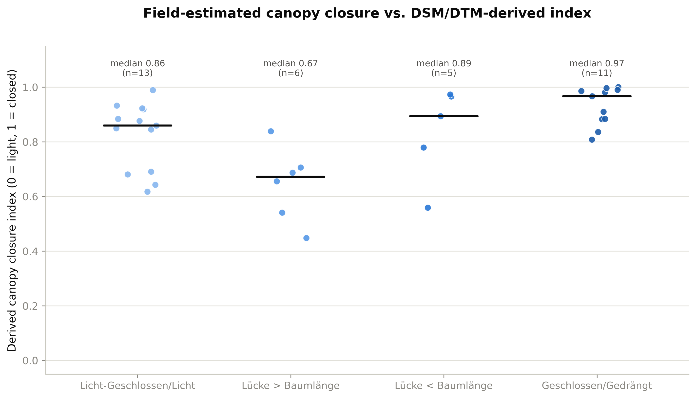
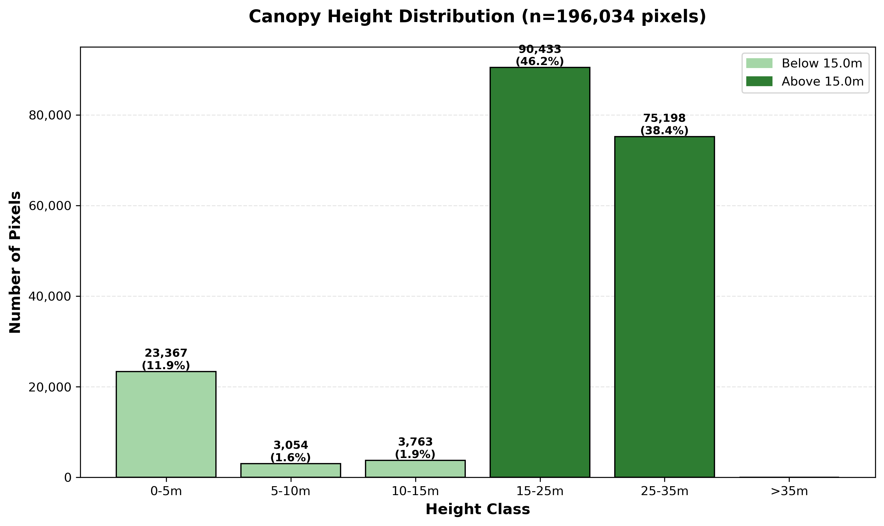

# Forestry Canopy Height Analysis

Production-ready Python system for analyzing canopy height distributions at forestry inventory locations using LDBV (Landesamt für Digitalisierung, Breitband und Vermessung) elevation products from Bavaria's GeoDatenOnline service.

## Features

- **Flexible input**: Single inventory points or transects (two points)
- **Automatic data acquisition**: Downloads DOM (20cm) and DGM (1m) via WCS 2.0.1 API
- **Normalized height derivation**: Computes nDOM = DOM - DGM with proper alignment
- **Smart analysis**: Only computes histogram if ≥25% of canopy exceeds height threshold
- **Production-ready**: Comprehensive error handling, validation, and logging
- **Interactive workflow**: Jupyter notebook for exploration and testing

## Sample Outputs

### Category Comparison


### Histogram Example (LVP10)


## Installation

### 1. Create Conda Environment

```bash
cd 34_light_availabilityP
conda env create -f requirements.yaml
conda activate forestry_inventory
```

### 2. Set LDBV Credentials

Option A - Environment variables (recommended):
```bash
export LDBV_USER="your_username"
export LDBV_PASS="your_password"
```

Option B - Will be prompted interactively when needed

### 3. Test DOM Endpoint (First Time Only)

Open and run `notebooks/forestry_workflow.ipynb`, Section 0 to discover the DOM WCS endpoint. Update `modules/ldbv_download.py` with the working configuration.

## Quick Start

### Python Script

```python
from canopy_histogram import canopy_histogram_ldbv

# Single point analysis
results = canopy_histogram_ldbv(
    coords=[(11.5234, 48.1372)],  # WGS84
    radius_m=50,
    classes=[0, 15, 25, 35, 50],
    output_plot_path="histogram.png"
)

# Access results
print(results['analysis']['summary_text'])
```

### Jupyter Notebook

```bash
jupyter notebook notebooks/forestry_workflow.ipynb
```

## Workflow

1. **Define location**: Provide 1 or 2 coordinate pairs
2. **Create buffer**: Circular (single point) or corridor/midpoint (transect)
3. **Download data**: Automatic WCS download of DOM (0.2m) and DGM (1m)
4. **Derive nDOM**: Align DGM to DOM grid, compute nDOM = DOM - DGM
5. **Clip raster**: Extract analysis area from buffered geometry
6. **Check threshold**: Calculate proportion above height threshold (default 15m)
7. **Compute histogram**: If ≥25% above threshold, classify heights
8. **Generate outputs**: Bar chart and text summary

## Parameters

### Required

- `coords`: `[(x, y)]` or `[(x1, y1), (x2, y2)]` - WGS84 by default
- `radius_m`: Buffer radius in meters
- `classes`: Height class breaks, e.g., `[0, 15, 25, 35, 50]`

### Optional

- `threshold_height_m`: Height threshold (default 15.0m)
- `min_prop_above_threshold`: Minimum proportion above threshold (default 0.25)
- `transect_mode`: `"buffer_line"` or `"midpoint_circle"` (default "buffer_line")
- `input_crs`: Coordinate CRS (default "EPSG:4326")
- `target_resolution_m`: Analysis resolution (default 0.2m for DOM native)
- `analysis_raster`: Pre-normalized raster path (skips download)
- `dom_raster`, `dgm_raster`: Local file paths (skips download)
- `output_plot_path`: Save histogram plot
- `output_clipped_raster_path`: Save clipped raster

## Examples

### Example 1: Single Point with WCS Download

```python
results = canopy_histogram_ldbv(
    coords=[(11.5234, 48.1372)],
    radius_m=50,
    classes=[0, 15, 25, 35, 50],
    target_resolution_m=0.2,  # 20cm for detail
    output_plot_path="outputs/point_histogram.png",
    output_clipped_raster_path="outputs/point_ndom.tif"
)
```

### Example 2: Transect with Local Files

```python
results = canopy_histogram_ldbv(
    coords=[(11.5234, 48.1372), (11.5298, 48.1401)],
    radius_m=25,
    classes=[0, 10, 20, 30, 40],
    transect_mode="buffer_line",
    dom_raster="data/DOM.tif",
    dgm_raster="data/DGM.tif"
)
```

### Example 3: Fast Processing (1m Resolution)

```python
results = canopy_histogram_ldbv(
    coords=[(11.5234, 48.1372)],
    radius_m=50,
    classes=[0, 15, 25, 35, 50],
    target_resolution_m=1.0,  # Faster processing
    verbose=True
)
```

## Output Structure

```python
results = {
    'geometry': {
        'buffer_geometry': GeoDataFrame,
        'area_ha': float,
        'extent_25832': tuple,  # For LDBV download
        'extent_4326': dict      # For display
    },
    'raster': {
        'clipped_array': np.ndarray,
        'metadata': dict,
        'stats': dict,
        'resolution_m': float
    },
    'analysis': {
        'threshold_met': bool,
        'threshold_stats': dict,
        'histogram': dict or None,
        'summary_text': str
    },
    'outputs': {
        'plot_path': str or None,
        'raster_path': str or None
    },
    'download_info': dict
}
```

## Project Structure

```
34_light_availabilityP/
├── modules/
│   ├── __init__.py
│   ├── validation.py       # Input validation
│   ├── geometry.py          # Buffering, CRS handling
│   ├── ldbv_download.py     # WCS download (DGM + DOM)
│   ├── raster.py            # Raster ops, nDOM derivation
│   ├── analysis.py          # Height analysis, histogram
│   └── plotting.py          # Visualization
├── notebooks/
│   └── forestry_workflow.ipynb  # Interactive tutorial
├── canopy_histogram.py      # Main entry point
├── requirements.yaml        # Conda environment
└── README.md
```

## Resolution Strategy

**Default: 0.2m (DOM native resolution)**

- DOM downloaded at 0.2m (20cm) - maximum detail
- DGM downloaded at 1m, upsampled to 0.2m via bilinear interpolation
- Final nDOM at 0.2m resolution for tree-level analysis

**Alternative: 1.0m (faster processing)**

- Set `target_resolution_m=1.0` for 25x fewer pixels
- Trade-off: Lose fine spatial detail but faster processing
- Suitable for large-scale surveys

## Coordinate Systems

- **Input**: EPSG:4326 (WGS84) default, customizable
- **Buffering**: Auto-detects UTM zone or EPSG:25832 for Bavaria
- **LDBV WCS**: EPSG:25832 (UTM 32N, LDBV native)
- **Output extents**: Both EPSG:25832 (for download) and EPSG:4326 (for display)

## Troubleshooting

### DOM Endpoint Not Working

1. Run notebook Section 0 to test candidate endpoints
2. Check LDBV documentation for DOM WCS availability
3. Fallback: Use manual download with `dom_raster` parameter

### Credentials Error

```python
# Set explicitly
os.environ['LDBV_USER'] = 'username'
os.environ['LDBV_PASS'] = 'password'
```

### Threshold Not Met

Area may have low canopy cover (<25% above 15m). Check summary statistics:

```python
print(results['analysis']['threshold_stats'])
```

### Memory Issues

- Reduce buffer radius
- Use `target_resolution_m=1.0` instead of 0.2
- Process smaller batches

### No Valid Data

Check if geometry overlaps raster extent:

```python
print(results['geometry']['extent_25832'])
print(results['raster']['stats'])
```

## Dependencies

- **Core**: rasterio, geopandas, shapely, numpy, pandas
- **Visualization**: matplotlib
- **CRS**: pyproj
- **WCS**: requests
- **Interactive**: jupyter, ipykernel

See `requirements.yaml` for complete list.

## LDBV Data Products

### DGM1 (Digital Ground Model)
- **Resolution**: 1m native
- **WCS Endpoint**: `https://geoservices.bayern.de/pro/wcs/dgm/v1/wcs_inspire_dgm1?`
- **Coverage ID**: `EL.ElevationGridCoverage`
- **Status**: ✅ Working

### DOM (Digital Surface Model)
- **Resolution**: 20cm or 40cm (region-dependent)
- **WCS Endpoint**: 🔍 To be determined via testing (see notebook Section 0)
- **Coverage ID**: 🔍 To be determined
- **Status**: ⚠️ Requires testing

### nDOM (Normalized Height Model)
- **Derived product**: nDOM = DOM - DGM
- **Resolution**: Matches DOM (default 0.2m)
- **Not available as direct LDBV product**

## License

Developed for forestry inventory applications in Bavaria, Germany.

## Support

For LDBV access and credentials:
- https://geodatenonline.bayern.de/
- https://geoservices.bayern.de/

For code issues:
- Check notebook Section 0 for DOM endpoint testing
- Review error messages for specific module failures
- Examine verbose output for workflow step details

## Citation

If using this tool in research, please cite:
- LDBV data source: Bayerische Vermessungsverwaltung
- Software: Forestry Canopy Height Analysis Tool v1.0

---

**Author**: Professional forestry GIS workflow
**Version**: 1.0.0
**Date**: 2024
